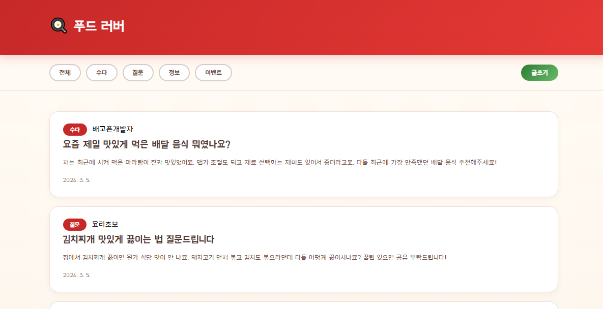
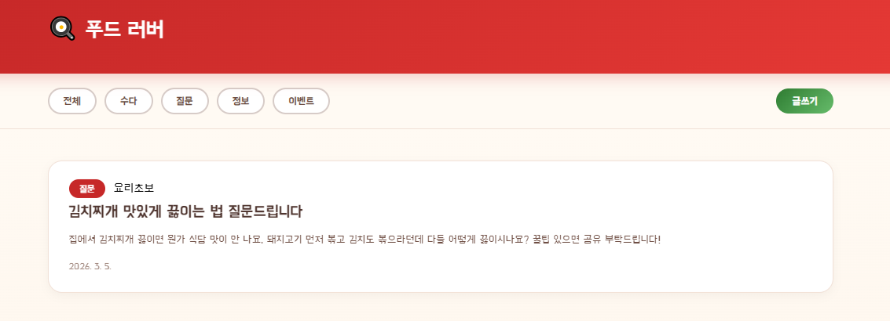
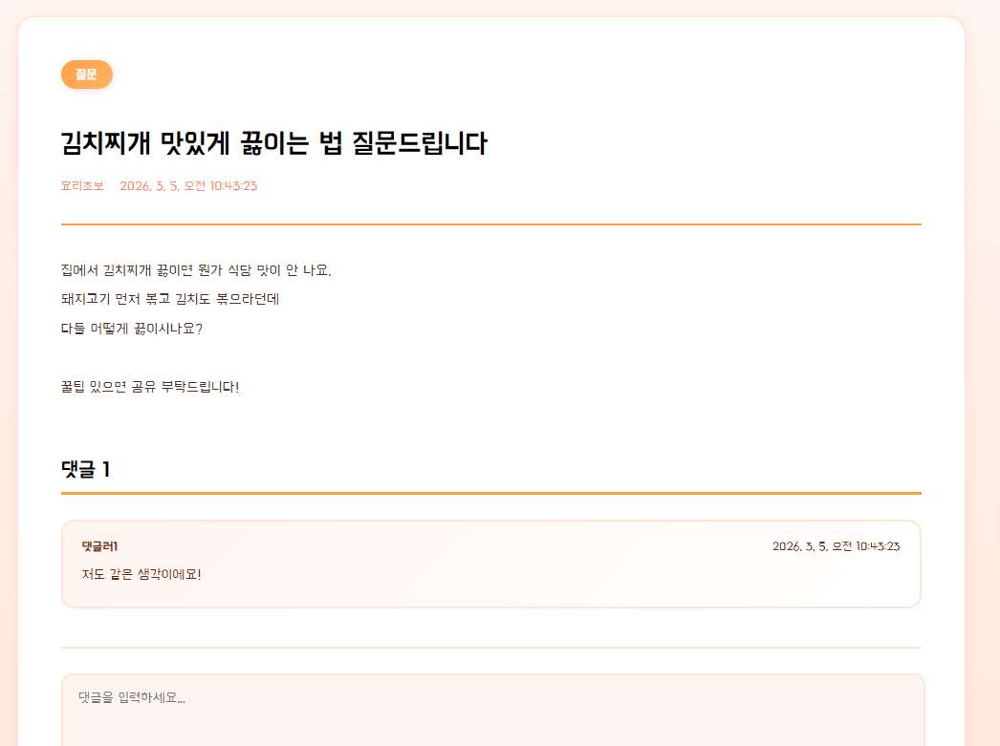
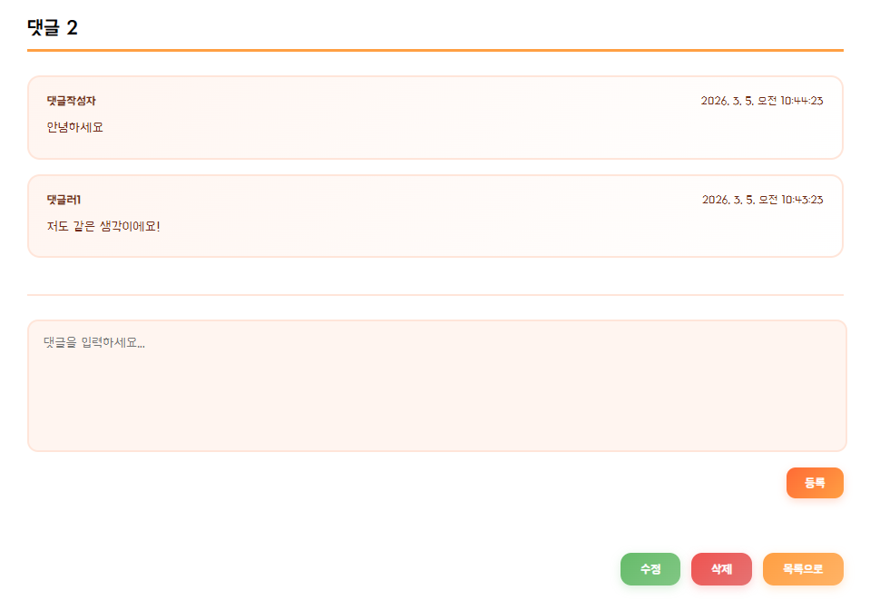

# 푸드 러버 게시판

## 📝 프로젝트 소개
리액트만 사용해서 만들어본 질답형 게시판입니다.
게시글을 작성할 땐 카테고리를 정할 수 있으며 그에 따라 본인이 원하는 카테고리의 게시글만 볼 수 있습니다.
게시글, 댓글을 작성할 수 있지만 db에 연결되어 있지 않기 때문에
새로고침할 때마다 데이터가 유실됩니다.

자세한 커밋 사항은
[react-diy](https://github.com/domino3333/react-diy)
(폴더: board01)에 있습니다.

---

## 🛠 개발 환경

| 구분 | 내용 |
|---|---|
| OS | Windows 11 Home |
| IDE | Visual Studio Code |
| React | 19.2.0 |
| react-dom | 19.2.0 |
| react-router-dom | 7.13.0 |
| node.js | v24.13.0 |
| 형상관리 도구 | Git, GitHub |

---

## ✨ 주요 기능

- 자유게시판
- 게시글의 카테고리 지정 후 그에 대한 필터 제공
- 게시글 작성
- 댓글 작성

## 📸 실행 화면

### 🏠 게시판 메인 화면

### 📋 게시글 필터 화면

### 👤 게시글 화면

### 👤 댓글 화면

